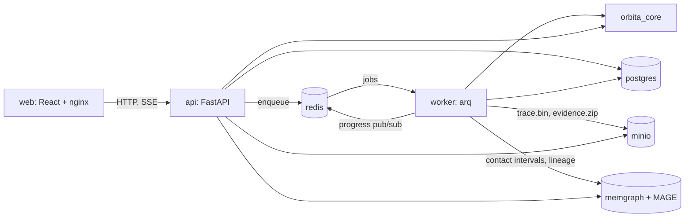

# 06. Инфраструктура и хранение

| Статус | Обновлён | Заменяет | Агенту |
|---|---|---|---|
| Действует | 2026-09-11 | `05_architecture_and_storage.md` | Состав сервисов фиксирован ADR-008. Доступ к каждому внешнему хранилищу только через адаптер с локальной реализацией для degraded mode |

## 1. Компоненты и потоки



| Сервис | Образ | Работа в v1 | Роль при росте |
|---|---|---|---|
| `web` | nginx + сборка Vite | статика, reverse proxy на `api` | отдельный релиз фронтенда |
| `api` | Python 3.12, FastAPI, uvicorn | валидация, CRUD, snapshot/metrics/export, SSE | stateless, реплики за балансировщиком |
| `worker` | тот же образ, `arq` | суточные Run, sweep, criticality, Evidence Pack | горизонтально: N воркеров = N параллельных задач |
| `postgres` | postgres 16 | проекты, варианты, runs, метрики, перерывы, точки sweep, `jobs` | транзакции, индексы, аналитика по тысячам Run |
| `redis` | redis 7 | очередь arq, прогресс pub/sub, кэш preview, idempotency | TTL, низкая задержка |
| `memgraph` | memgraph/memgraph-mage | временной граф сохранённых Run, lineage, графовые алгоритмы | in-memory графы, Cypher, Bolt |
| `minio` | minio/minio | трассы, Evidence Pack, экспорт | blob-хранилище, версии, lifecycle-правила |

`docker compose up` поднимает все семь; `make demo` дополнительно загружает четыре
сценария и выполняет по одному Run для каждого.

## 2. Оценка роста нагрузки и объёмов

Обозначения: `N` — спутников, `T` — отсчётов (720), `G` — наземных пунктов.

| Показатель | Формула | N = 48 | N = 500 | N = 2 000 |
|---|---|---:|---:|---:|
| ISL-пар на отсчёт | `N(N−1)/2` | 1 128 | 124 750 | ~2,0 млн |
| Проверок ISL за сутки | `T·N(N−1)/2` | 0,8 млн | 90 млн | 1,4 млрд |
| Наземных пар за сутки | `T·N·G` | 138 тыс. | 1,4 млн | 5,8 млн |
| Время расчёта суток (numpy, 1 ядро) | измерено / экстраполяция | ~0,4 с | секунды | десятки секунд без pruning |
| Трасса bitset до сжатия | `T·E/8` байт | ~34 КБ | ~11 МБ | ~180 МБ |
| Трасса после zstd | измерено на 48 | ~6 КБ | ~1–3 МБ | ~20–40 МБ |
| Sweep 20 × 20 точек | `400 · t_run` | 3 мин на 1 воркере, 45 с на 4 | часы → нужны воркеры | не для sweep |

Выводы, которые пишутся в ADR и на слайд:
- при `N ≥ 500` нужен spatial pruning: кандидаты ISL только внутри `isl_range_km` по сетке
  или KD-дереву, что снижает пары с `O(N²)` до `O(N·k)`;
- при `N ≥ 500` трасса не помещается в строку Postgres разумно; отсюда MinIO;
- sweep и criticality — это `M` независимых задач; их масштабирует число воркеров, а не
  скорость одного ядра;
- координаты никогда не хранятся: восстанавливаются из сценария и `t_s`.

Измеренные размеры трасс на предоставленных сценариях (bitset «отсчёты × возможные рёбра»):

| Сценарий | До сжатия | После zlib |
|---|---:|---:|
| 01 полная | 33,8 КБ | 5,8 КБ |
| 02 первая очередь | 7,0 КБ | 1,2 КБ |
| 03 десять отказов | 33,6 КБ | 7,7 КБ |
| 04 ISL 2000 км | 26,7 КБ | 5,2 КБ |

Availability timeline трёх клиентов: 270 байт несжатого bitset.

## 3. PostgreSQL

Таблицы (миграции Alembic, одна миграция на изменение схемы):

```text
projects            id, title, created_at, active_variant_id
variants            id, project_id, parent_variant_id, title, scenario jsonb,
                    diff_from_parent jsonb, config_hash, created_at
runs                id, variant_id, routing_policy, engine_version, config_hash,
                    status, stage, progress, completed_ticks, total_ticks,
                    created_at, started_at, finished_at, duration_ms, trace_uri, error jsonb,
                    degraded_mode
client_metrics      run_id, client_id, availability, visibility, max_gap_s,
                    mean_hops, max_hops, route_switches, target_met,
                    outage_count_by_cause jsonb
config_metrics      run_id, min_client_availability, mean_client_availability,
                    worst_max_gap_s, mean_hops, max_hops, route_switches_total,
                    backup_path_count_min, outage_count_by_cause jsonb, target_met_clients jsonb
outage_intervals    id, run_id, client_id, start_s, end_s, truncated_by_horizon,
                    primary_cause, causes jsonb, evidence jsonb
experiments         id, project_id, base_variant_id, axes jsonb, budget jsonb,
                    routing_policy, status, created_at
experiment_points   id, experiment_id, params jsonb, config_hash, run_id,
                    min_client_availability, worst_max_gap_s, mean_client_availability
recommendations     id, base_run_id, recommended_run_id, payload jsonb, created_at
jobs                id, kind, payload jsonb, status, attempts, enqueued_at,
                    started_at, finished_at, error jsonb
artifacts           id, run_id, kind, uri, size_bytes, created_at, expires_at
```

Индексы: `runs(config_hash, engine_version)` уникальный **частичный** — только для
`status IN ('queued', 'running', 'succeeded')`, чтобы упавший или отменённый Run можно
было перезапустить той же конфигурацией; `client_metrics.mean_hops`, `max_hops` и
`config_metrics.mean_hops`, `max_hops`, `backup_path_count_min` обнуляемы (клиент без
единого пути);
`experiment_points(experiment_id)`; `outage_intervals(run_id, client_id)`.
Очередь живёт в Redis (arq), таблица `jobs` — журнал для истории, повторов и аудита.

## 4. Memgraph

Что хранится и зачем:

```text
(:Run {id, engine_version, routing_policy})
  -[:HAS_NODE]-> (:Node {run_id, node_id, kind: 'satellite'|'client'|'gateway', plane_id})

(:Node)-[:CONTACT {run_id, start_tick, end_tick, min_distance_km, max_distance_km}]->(:Node)
      контакты хранятся интервалами, а не отдельным ребром на каждый отсчёт

(:Variant {id, project_id, title, config_hash})
  -[:DERIVED_FROM {diff, delta_min_availability, delta_worst_max_gap_s}]-> (:Variant)
```

Запросы, которые обслуживает Memgraph:
- Experiment Lineage: путь от baseline к любому варианту с дельтами по рёбрам;
- «какие аппараты входят во все пути клиента `C` в интервале отсчётов `[a; b]`»;
- bridges и biconnected components (MAGE) на графе контактов отсчёта для подсветки
  уязвимых линий;
- betweenness (MAGE) как вспомогательный сигнал в Resilience X-Ray.

`(run_id, node_id)` уникален. Сохраняются Run, помеченные пользователем, и лучшие точки
sweep; промежуточные точки — нет.

## 5. Redis и MinIO

Redis-ключи:

```text
arq:queue                          очередь задач
run:{id}                           pub/sub прогресса
preview:{config_hash}:{t_s}        кэш snapshot, TTL 1 ч
idem:{key}                         idempotency → run_id, TTL 24 ч
run:{id}:cancel                    флаг отмены расчёта, TTL 1 ч
```

MinIO-бакет `orbita`, ключи:

```text
runs/{run_id}/trace.bin            contact plan, zstd
runs/{run_id}/export.json          cosmo-A-result-1.0
runs/{run_id}/evidence.zip         Evidence Pack
experiments/{id}/points.parquet    точки sweep для выгрузки
```

## 6. Политика хранения

| Данные | Срок |
|---|---|
| preview одного отсчёта | Redis, 1 ч |
| несохранённые интерактивные Run | 24 ч |
| трассы точек sweep | 7 дней |
| параметры и метрики sweep | до удаления Experiment |
| сохранённые и лучшие варианты с трассами | до удаления Project |
| экспорт и Evidence Pack | до удаления Project |

Lifecycle-правила MinIO реализуют TTL трасс. После удаления трассы Run пересчитывается из
сценария, `engine_version` и seed; если версия ядра больше недоступна, интерфейс сообщает
об этом явно.

## 7. Надёжность и degraded mode

- Состояния Job: `queued / running / succeeded / failed / cancelled`; повтор при сбое
  воркера до 3 раз.
- Результат Run записывается атомарно после завершения; частичные артефакты помечаются и
  очищаются.
- `config_hash` проверяется перед использованием кэша.
- Лимиты: размер JSON ≤ 10 МБ, `N ≤ 5 000`, `max_points` sweep ≤ 2 000, время sweep ≤ 30 мин.
- `/api/health` проверяет все сервисы; при недоступности Redis, Memgraph или MinIO
  одиночный Run выполняется в процессе API с локальными адаптерами (файловая система,
  память), ответ помечается `degraded_mode: true`. Это покрывается отдельным тестом
  compose-профиля `degraded`; на защите основной режим — полный.
